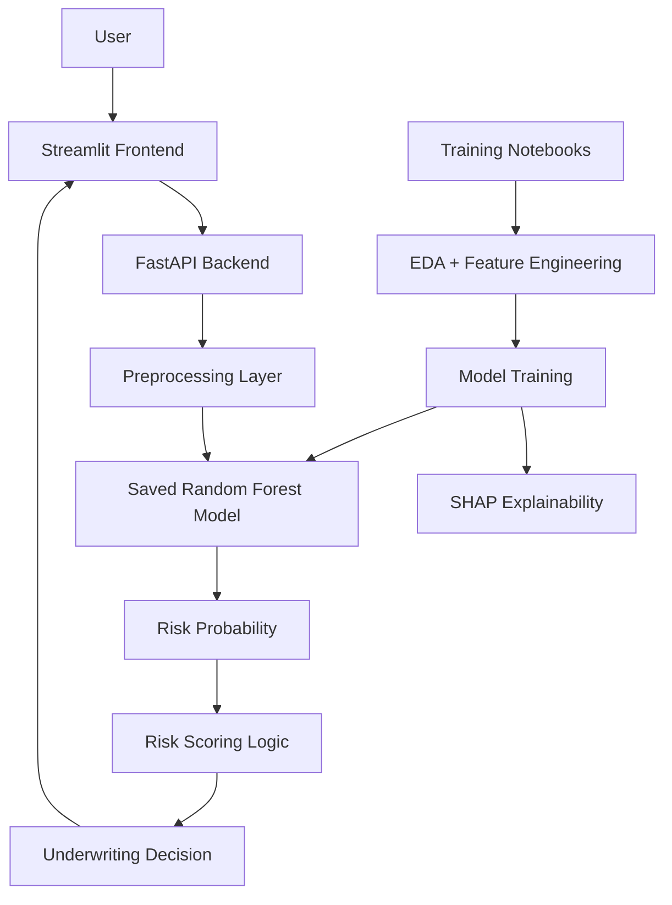

# AI-Powered Health Insurance Underwriting Risk Engine

This project predicts high-claim underwriting risk for health insurance policyholders using portfolio, premium, utilization, and policy data.

## Project Components

- Insurance EDA
- Data cleaning
- Feature engineering
- High-claim risk prediction model
- SHAP explainability
- FastAPI inference API
- Streamlit frontend dashboard

## Model Performance

- Accuracy: 82.9%
- ROC AUC: 0.935
- High-risk recall: 92%
- High-risk precision: 60%

## Architecture



The Streamlit frontend collects policyholder inputs and sends them to the FastAPI backend.

FastAPI applies preprocessing, loads the trained Random Forest model, generates risk probability, computes risk score and risk tier, and returns the underwriting decision to the frontend.

## How to Run

### 1. Install dependencies

```bash
pip install -r requirements.txt
